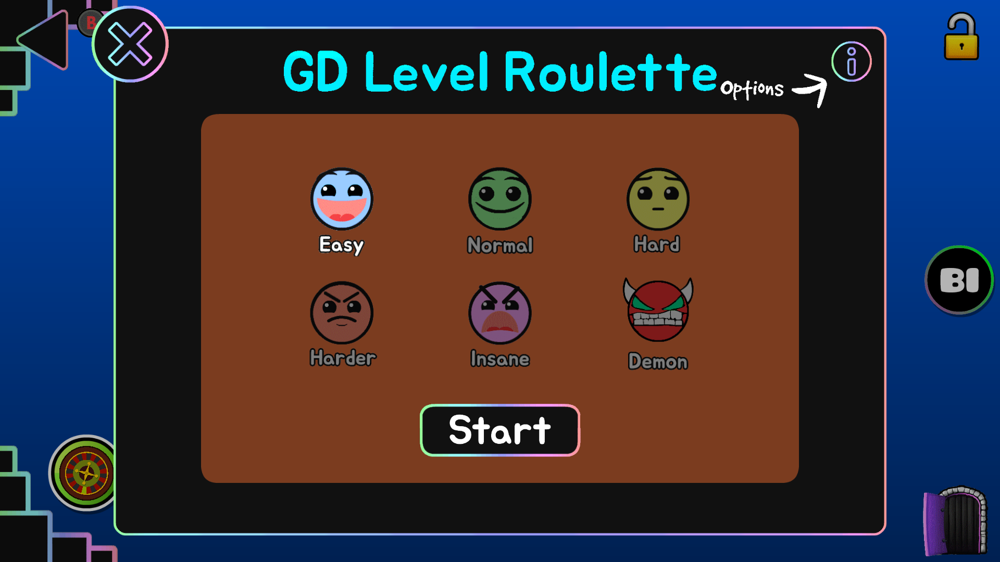
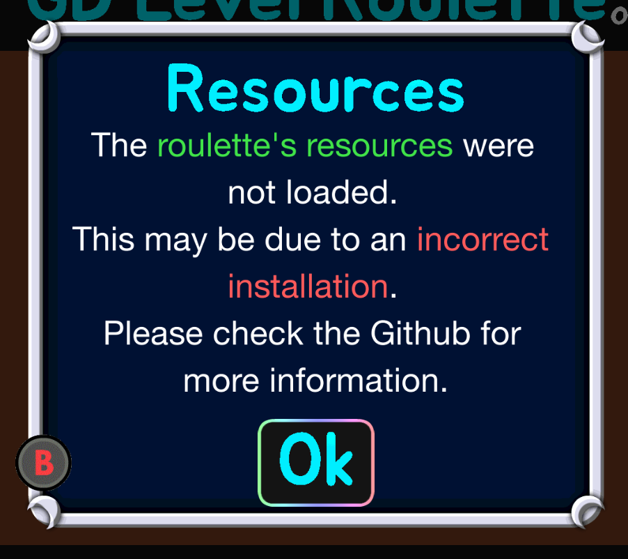

# GD-Roulette
A Geometry Dash Roulette.

<details>
<summary>Image of the roulette</summary>
<br>

</details>

## How to install
1. Download the latest release from the the [Releases tab](https://github.com/SpaghettDev/GD-Roulette/releases)
1. Copy the contents of the resources.zip from the downloaded release into the "Resources" folder of your Geometry Dash installation.
2. Then grab GD-Roulette.dll from the downloaded release and use you preferred injector to inject it into GeometryDash.exe

## Errors
<details open>
<summary>Error Image</summary>
<br>

</details>

If you're getting the error above then you haven't installed the roulette correctly...
<br/>
Please follow the instructions in the [How to install](#how-to-install) part.

## How to build
Run the following commands in your preferred terminal:
```sh
git clone https://github.com/SpaghettDev/GD-Roulette
cd GD-Roulette
mkdir build
cd build
cmake ..
```
Then open the generated solution in Visual Studio.

**Make sure to compile in Release Mode! Otherwise the solution will not compile.**

## Credits
- SpaghettDev ([@SpaghettDev](https://github.com/SpaghettDev)): Creator & maintainer.
- Skyue1 ([@Skyue1](https://github.com/Skyue1)): Added the featured/epic glow, and other stuff.
- iAndyHD3 ([@iAndyHD3](https://github.com/iAndyHD3)): Helped with issues.
- Cvolton ([@Cvolton](https://github.com/Cvolton)): Helped with issues. And the buttons (RL_blankBtn_001).
- Alphalaneous ([@Alphatism](https://github.com/Alphatism)): Helped with issues.
