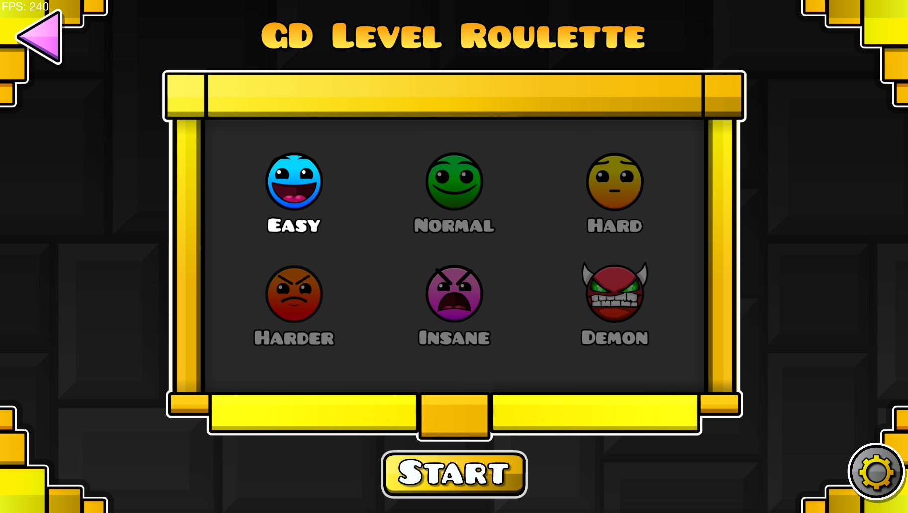

# GD-Roulette

A Geometry Dash Level Roulette.

<details open>
<summary>Image of the roulette</summary>
<br>

</details>

## How to install (from Geode)

1. Get [Geode](https://geode-sdk.org)
2. Click the Geode button
3. Click the download tab, find GD-Roulette, and click Install!

You'll now find the roulette button after clicking the Create button on the main menu.

## How to install (from Releases)

1. Download the latest release's GD-Roulette.geode file
2. Copy it to `Geometry Dash/geode/mods`

## How to build

Run the following commands in your preferred terminal:

```sh
git clone https://github.com/SpaghettDev/GD-Roulette
cd GD-Roulette
mkdir build
cd build
cmake ..
```

Then open the generated solution in Visual Studio.

## Donate

This mod has taken a lot of time to make and refine, so your donation would be much appreciated!
You can help fuel the next 50 hours I spend on this mod and my other mods by [donating through Ko-fi](https://ko-fi.com/spaghettdev)!

## Contact

You can contact me through my personal [Discord server](https://discord.gg/3bShQb6Jz3) to get instant™️ support and other stuff ig.

## Credits

- SpaghettDev ([@SpaghettDev](https://github.com/SpaghettDev)): Creator & maintainer.
- qwix ([@qwix456](https://github.com/qwix456)): Added the featured/epic glow, and other stuff.
- iAndyHD3 ([@iAndyHD3](https://github.com/iAndyHD3)): Helped with issues.
- Cvolton ([@Cvolton](https://github.com/Cvolton)): Helped with issues.
- Alphalaneous ([@Alphalaneous](https://github.com/Alphalaneous)): Helped with issues.
- mat ([@matcool](https://github.com/matcool)): Helped with Geode issues.
